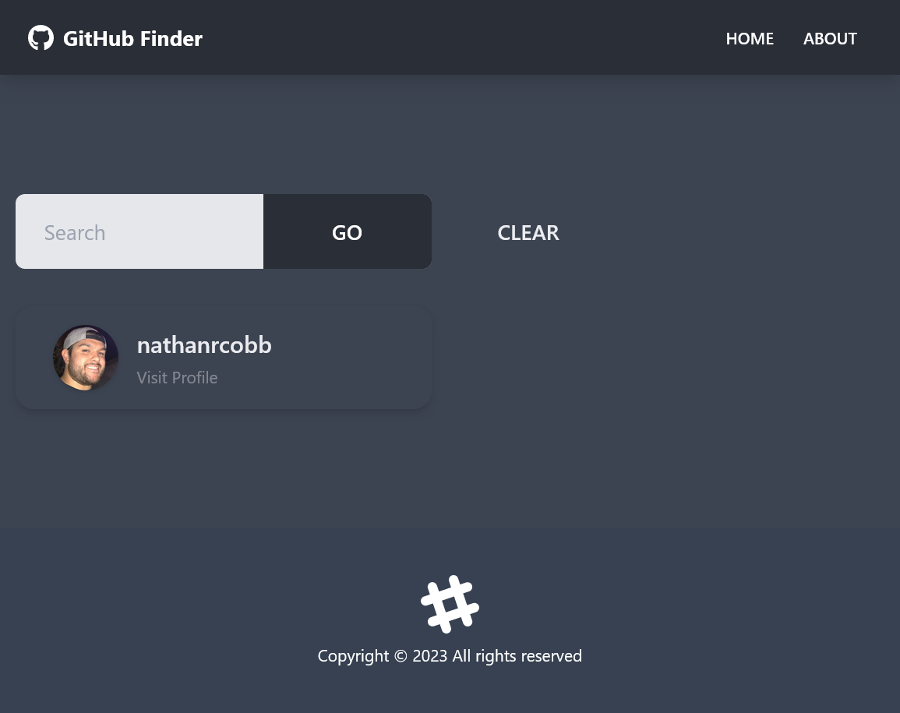

# [GitHub Finder](https://github-finder-rosy.vercel.app/)



## Description

A GitHub Profile browser built with React.

### Why?

I built this as part of a Udemy course I was using to learn React from the ground up.

## Installation

Here are the things you'll need if you want to run this project locally:

1. [NodeJS](https://nodejs.org/en/download)

Once the above is installed:

1. Clone this repository
2. Open a terminal and navigate to the project's root directory
3. Install the required packages via NPM

   ```shell
   npm install
   ```

## Usage

Rename **_.env.template_** to **_.env_**

You can use the Github API without a personal token, but if you want to use your token, add it to the .env file

Learn how to create a token [here](https://docs.github.com/en/authentication/keeping-your-account-and-data-secure/creating-a-personal-access-token)

To run the project locally:

```shell
npm start
```

## Credit

Tailwind UI created by [Hassib Moddasser](https://twitter.com/hassibmoddasser)
